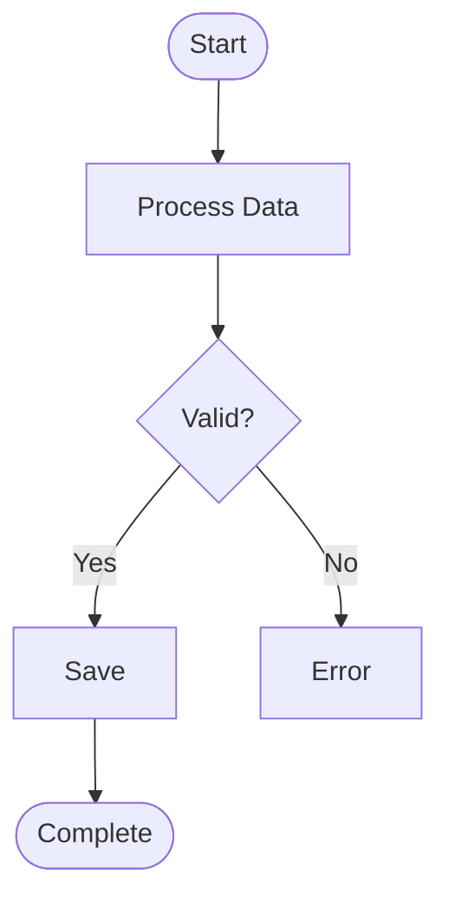
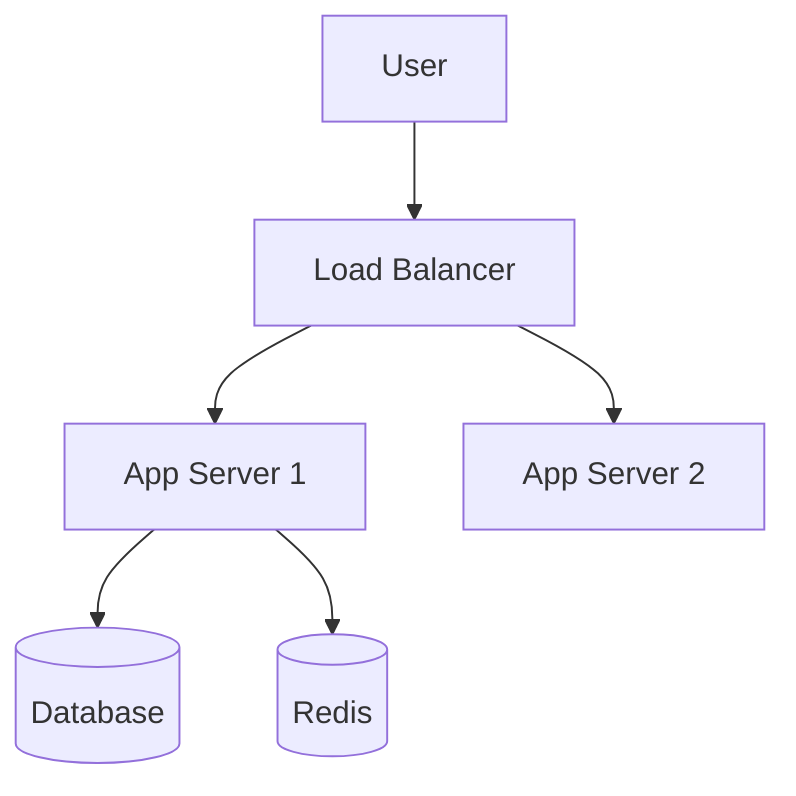
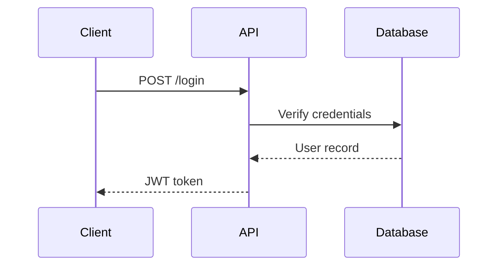
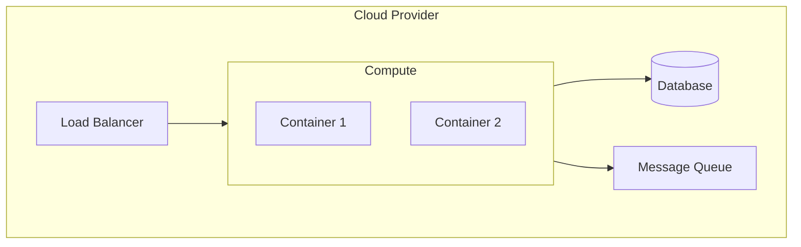

<objective>
Help the user write any document — design doc, README, Jira ticket, RFC, architecture proposal, runbook — at the right shape for its audience and venue. When a diagram makes the doc clearer (workflow, infra, API flow, system topology), generate Mermaid source and render it via the draw.io MCP plugin so the user gets an editable, shareable diagram instead of a static fence.

The skill assumes diagrams are a TOOL, not the goal. Many docs (Jira tickets, short ADRs, runbook steps) need no diagram at all.
</objective>

<when_to_activate>
- User asks to "write a design doc", "draft a README", "create a Jira ticket", "write an RFC", "document this"
- User asks to "create a diagram", "generate mermaid", "code to diagram", "open in draw.io"
- User asks to turn a conversation, code, or notes into structured documentation
- User asks to update existing docs to match new code or decisions
</when_to_activate>

<doc_type_decision_tree>
Pick the right shape before writing:

| Venue / Intent | Doc Type | Typical Sections | Diagram? |
|---|---|---|---|
| New system / major architecture choice | Design doc / RFC | Context, Goals, Non-goals, Decision, Alternatives, Risks, Open questions | Usually yes (1-3) |
| Bug or task assignment | Jira ticket | Summary, Repro, Expected vs Actual, Acceptance criteria | Usually no |
| Service / repo intro | README | What, Why, Run locally, Architecture, Contributing | Sometimes (1 architecture) |
| One specific decision | ADR | Status, Context, Decision, Consequences | Rarely |
| Incident response | Postmortem | Timeline, Impact, Root cause, Remediation, Action items | Optional (sequence/timeline) |
| Operational procedure | Runbook | Trigger, Steps, Verification, Rollback | Optional (decision tree) |
| Cross-team alignment | Tech proposal | Problem, Proposed approach, Tradeoffs, Migration plan | Often (state-before/after) |

The decision tree is suggestive, not prescriptive — ask the user what venue the doc lives in (Confluence, Jira, GitHub, code repo, Slack) before picking the shape.
</doc_type_decision_tree>

<jira_ticket_shape>
Jira tickets are the most common shape that ISN'T a design doc. Default template:

```
**Summary** (one sentence — what the work is)

**Why now / context**
[1-3 lines of background. Link the parent epic if one exists.]

**Acceptance criteria**
- [ ] Specific, observable outcome 1
- [ ] Specific, observable outcome 2
- [ ] Tests added / updated

**Out of scope**
[Anything a reviewer might assume is in but isn't.]

**Notes / links**
- Related PRs:
- Related Jira: PBAT-...
- Slack thread:
```

Skip diagrams in tickets unless the work is intrinsically visual (e.g. a new sequence between services). If the ticket is being filed from a design doc, link the design doc — don't restate it.

Before creating: GREP the epic / sibling tickets for already-shipped overlapping work (from `feedback-grep-epic-before-filing`).
</jira_ticket_shape>

<design_doc_shape>
Heavyweight docs (RFC, design doc, tech proposal) follow a common skeleton — adapt section names to the org's template:

```
# <Title>

## Context
Why this exists. What problem we're solving. Link prior art.

## Goals
Bulleted, observable success conditions.

## Non-goals
What this explicitly does NOT solve. Prevents scope creep in review.

## Proposed design
The actual decision + how it works. THIS is where diagrams usually go.

## Alternatives considered
Each alternative + why it lost. One paragraph each — not a survey.

## Risks / open questions
Honest list. Open questions belong here, not in chat.

## Migration / rollout
If applicable: stages, kill switches, rollback plan.

## Verification
How we'll know it worked — metrics, tests, monitors.
```

Keep alternatives honest — reviewers smell straw-man comparisons. Cite real evidence (links to issues, PRs, benchmark runs) rather than asserting tradeoffs.
</design_doc_shape>

<render_to_drawio>
When a diagram IS needed, draw.io MCP plugin (`@drawio/mcp`) is the primary render path. It builds a draw.io URL with the diagram in the URL `#fragment` (so the payload never leaves the user's machine) and opens it locally in the browser.

| Tool | Use For | Input |
|------|---------|-------|
| `mcp__drawio__open_drawio_mermaid` | Any Mermaid source you just generated | Raw Mermaid text (the same string you'd put inside a ```mermaid fence) |
| `mcp__drawio__open_drawio_xml` | Hand-authored mxGraph XML, or XML exported from another tool | draw.io XML |
| `mcp__drawio__open_drawio_csv` | Tabular node/edge data | CSV per draw.io's CSV import spec |

**Default workflow:**
1. Decide diagram type (see `<diagram_type_decision_tree>`)
2. Generate Mermaid source applying the patterns + styling rules below
3. Call `mcp__drawio__open_drawio_mermaid` with that source — DO NOT paste it as a Markdown fence first
4. Also keep the Mermaid source in the design doc (or under `./diagrams/<name>.mmd`) so it's diff-able in git

If the user explicitly asks for "just the Mermaid", skip step 3. If the doc has no diagrams (Jira ticket, short ADR), skip this whole block.
</render_to_drawio>

<diagram_type_decision_tree>
Analyze user intent to determine diagram type:

| User Request | Diagram Type |
|--------------|-------------|
| "workflow", "process", "business logic", "user flow" | Activity diagram (flowchart) |
| "infrastructure", "deployment", "cloud", "k8s" | Deployment diagram |
| "system architecture", "components", "microservices" | Architecture diagram |
| "API flow", "interactions", "request/response" | Sequence diagram |
| "code to diagram" | Analyze code → pick appropriate type(s) |
| "design document", "full docs" | Multiple diagrams + prose |
</diagram_type_decision_tree>

<diagram_patterns>

### Activity Diagram (Workflows)


### Architecture Diagram (Components)


### Sequence Diagram (API Flows)


### Deployment Diagram (Infrastructure)

</diagram_patterns>

<styling_rules>
ALL diagrams MUST use high-contrast colors:
```mermaid
classDef primary fill:#90EE90,stroke:#333,stroke-width:2px,color:darkgreen
classDef secondary fill:#87CEEB,stroke:#333,stroke-width:2px,color:darkblue
classDef database fill:#E6E6FA,stroke:#333,stroke-width:2px,color:darkblue
classDef error fill:#FFB6C1,stroke:#DC143C,stroke-width:2px,color:black
```

Rules:
- Light background → Dark text color
- Always specify `color:` in every `classDef`
- One diagram = one concept (single responsibility)
- Avoid emoji/Unicode symbols in node labels — draw.io's Mermaid import handles them inconsistently across themes. Use text labels and let `classDef` carry the visual semantics.
</styling_rules>

<code_to_diagram>
When converting source code to diagrams:

1. **Identify framework** — Look for routing patterns, decorators, annotations
2. **Map architecture** — Controllers → Services → Repositories → Database
3. **Extract flows** — Follow method call chains for sequence diagrams
4. **Find business logic** — Conditionals and loops → activity diagrams
5. **Map infrastructure** — Docker/K8s/cloud configs → deployment diagrams

Generate multiple diagram types from a single codebase when appropriate.
</code_to_diagram>

<validation>
Validate Mermaid syntax BEFORE calling the draw.io tool — a malformed Mermaid string will surface as a vague error in the browser tab.

Quick checks:
- Every node referenced in an edge is defined somewhere
- Subgraph names don't collide with node IDs
- `classDef` names referenced via `class` actually exist
- Pasted into https://mermaid.live renders without error

Only after the source validates, call `mcp__drawio__open_drawio_mermaid`. **NEVER add a Mermaid fence to a Markdown doc until you've round-tripped it through validation.**
</validation>

<file_naming>
When persisting Mermaid source alongside docs:
```
./diagrams/<doc_name>_<num>_<type>_<title>.mmd
```
Example: `./diagrams/api_design_01_sequence_auth_flow.mmd`

The draw.io plugin renders the diagram in the browser — you don't need to also produce a `.png`. If the user wants a static image, ask them to export from inside draw.io (File → Export As → PNG/SVG) so the export carries the embedded XML for later editing.
</file_naming>

<best_practices>
1. **Pick the doc shape first** — design doc vs ticket vs README vs ADR vs postmortem. Asking which venue the doc lives in saves a rewrite.
2. **Diagrams are optional** — many docs are better with zero diagrams. Don't force one just because the skill name has "diagrams" in it.
3. **Render via draw.io** — when a diagram IS used, round-trip through `mcp__drawio__open_drawio_mermaid` unless the user opted out.
4. **Single Responsibility** — One diagram = one concept.
5. **High Contrast** — Never skip `color:` in styles.
6. **Validate Early** — Check Mermaid syntax before opening in draw.io.
7. **Keep the source in git** — `.mmd` files diff cleanly; draw.io XML does not.
8. **Honest alternatives** — In design docs, alternatives must read as plausible options the reviewer might prefer, not straw men.
</best_practices>

<success_criteria>
- [ ] Doc shape matches the venue (Jira / Confluence / README / inline ADR)
- [ ] Audience is clear — explain to a stranger, not just the writer
- [ ] Diagrams included only where they make the doc clearer
- [ ] If diagrams used: high-contrast styling, Mermaid validated, `mcp__drawio__open_drawio_mermaid` called, source persisted to `.mmd`
- [ ] Single responsibility per diagram
- [ ] For Jira tickets: epic-grep done before file
- [ ] For design docs: alternatives are honest, not straw-manned
</success_criteria>