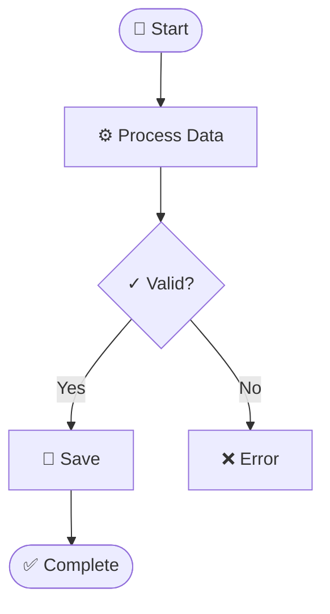
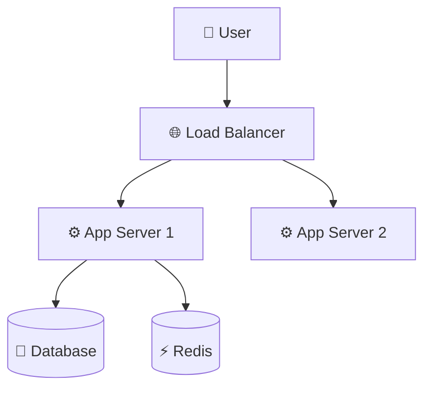
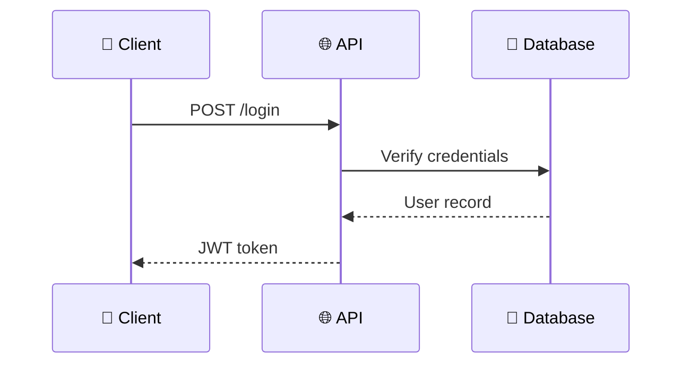
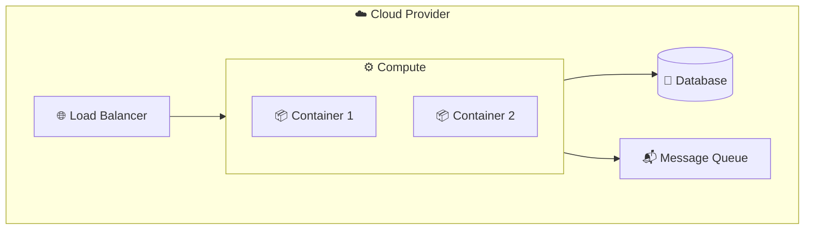

<objective>
Generate Mermaid diagrams and design documents from text descriptions or source code. Supports activity, deployment, sequence, and architecture diagram types with Unicode semantic symbols for clarity.
</objective>

<when_to_activate>
- User asks to "create a diagram", "generate mermaid", "document architecture"
- User asks to "code to diagram" or "create design doc"
- Need to visualize workflows, infrastructure, API flows, or system components
</when_to_activate>

<decision_tree>
Analyze user intent to determine diagram type:

| User Request | Diagram Type |
|--------------|-------------|
| "workflow", "process", "business logic", "user flow" | Activity diagram (flowchart) |
| "infrastructure", "deployment", "cloud", "k8s" | Deployment diagram |
| "system architecture", "components", "microservices" | Architecture diagram |
| "API flow", "interactions", "request/response" | Sequence diagram |
| "code to diagram" | Analyze code → pick appropriate type(s) |
| "design document", "full docs" | Multiple diagrams + prose |
</decision_tree>

<diagram_patterns>

### Activity Diagram (Workflows)


### Architecture Diagram (Components)


### Sequence Diagram (API Flows)


### Deployment Diagram (Infrastructure)

</diagram_patterns>

<unicode_symbols>
Use Unicode symbols to enhance diagram clarity:

| Category | Symbols |
|----------|---------|
| Infrastructure | ☁️ 🌐 🔌 📡 🗄️ |
| Compute | ⚙️ ⚡ 🔄 ♻️ 🚀 💨 |
| Data | 💾 📦 📊 📈 🗃️ |
| Messaging | 📨 📬 📤 📥 🐰 📢 |
| Security | 🔐 🔑 🛡️ 🚪 👤 🎫 |
| Monitoring | 📝 📊 🚨 ⚠️ ✅ ❌ |
</unicode_symbols>

<styling_rules>
ALL diagrams MUST use high-contrast colors:
```mermaid
classDef primary fill:#90EE90,stroke:#333,stroke-width:2px,color:darkgreen
classDef secondary fill:#87CEEB,stroke:#333,stroke-width:2px,color:darkblue
classDef database fill:#E6E6FA,stroke:#333,stroke-width:2px,color:darkblue
classDef error fill:#FFB6C1,stroke:#DC143C,stroke-width:2px,color:black
```

Rules:
- Light background → Dark text color
- Always specify `color:` in every `classDef`
- One diagram = one concept (single responsibility)
</styling_rules>

<code_to_diagram>
When converting source code to diagrams:

1. **Identify framework** — Look for routing patterns, decorators, annotations
2. **Map architecture** — Controllers → Services → Repositories → Database
3. **Extract flows** — Follow method call chains for sequence diagrams
4. **Find business logic** — Conditionals and loops → activity diagrams
5. **Map infrastructure** — Docker/K8s/cloud configs → deployment diagrams

Generate multiple diagram types from a single codebase when appropriate.
</code_to_diagram>

<validation>
Validate diagrams before adding to documents:
```bash
# Using Mermaid CLI (if installed)
mmdc -i diagram.mmd -o diagram.png -b transparent

# Or validate syntax in browser at mermaid.live
```

**NEVER add a diagram to markdown until it passes validation.**
</validation>

<file_naming>
```
./diagrams/<doc_name>_<num>_<type>_<title>.mmd
./diagrams/<doc_name>_<num>_<type>_<title>.png
```
Example: `./diagrams/api_design_01_sequence_auth_flow.png`
</file_naming>

<best_practices>
1. **Single Responsibility** — One diagram = one concept
2. **Unicode Enhancement** — Always use semantic symbols for clarity
3. **High Contrast** — Never skip `color:` in styles
4. **Validate Early** — Check syntax before adding to docs
5. **Load On-Demand** — Only generate diagram types needed for the request
</best_practices>

<success_criteria>
- [ ] Diagram type matches user intent
- [ ] Unicode symbols used for clarity
- [ ] High-contrast styling applied
- [ ] Diagram validates (no syntax errors)
- [ ] Single responsibility per diagram
</success_criteria>
